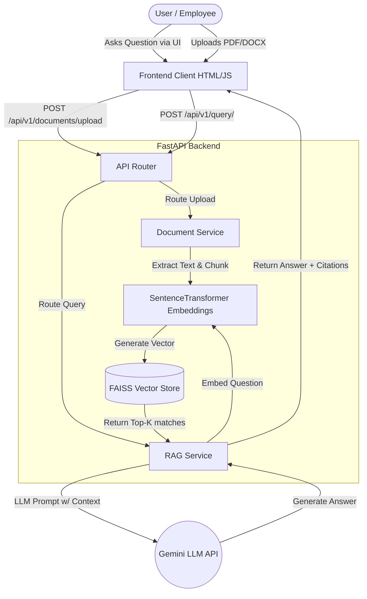
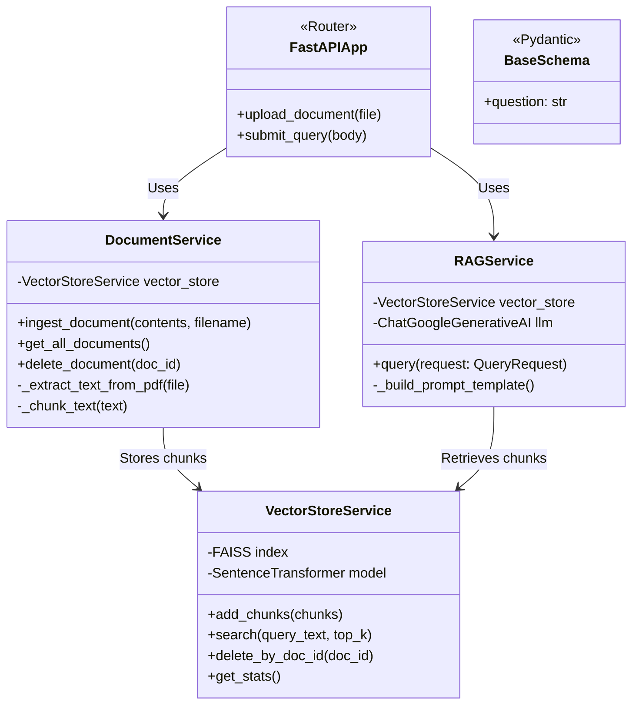

# Enterprise Knowledge Intelligence Platform Using RAG & Semantic Search

Welcome to the **Enterprise Knowledge Intelligence Platform**, a high-performance system designed to enable employees, developers, and administrators to uncover actionable intelligence from their entire corporate knowledge base using natural language.

By leveraging **Retrieval-Augmented Generation (RAG)** and **Semantic Search**, the platform securely indexes your private data and ensures that answers are always accurate, grounded, and fully cited with their original source files. 

---

## 🌟 Key Features

1. **Intelligent Document Ingestion**
   - Seamlessly upload multi-format corporate files: `.pdf`, `.docx`, and `.txt`
   - Configurable text chunking strategy using intelligent overlap to preserve sentence context.

2. **Semantic Search & Vector Store**
   - Integrates state-of-the-art **Sentence Transformers** (e.g., `all-MiniLM-L6-v2`) to perform semantic embedding.
   - High-throughput **FAISS** vector database for blazing-fast similarity searches over thousands of documents.

3. **Advanced Retrieval-Augmented Generation**
   - Configurable LLM Providers (**Google Gemini**, OpenAI, Anthropic).
   - Reduces AI hallucinations by feeding highly relevant local document chunks into the prompt context.

4. **Reference Accountability**
   - Every answer provided by the AI cites its exact source down to the internal document, boosting user trust.

5. **Extensible Frontend Dashboard**
   - Lightweight, dependency-free vanilla HTML/JS Frontend for easy distribution.
   - Built with enterprise aesthetics (dark mode, glassmorphism, responsive).

---

## 🏗 Architecture 

The system isolates the heavy lifting into two clear boundaries: a lightweight Frontend dashboard and a robust Python-based FastAPI backend that handles embeddings and LLM orchestration. 



---

## 📊 Class UML Diagram

A concise overview of the core Backend components. 



---

## 🚀 Setup & Installation

### Requirements
- Python 3.11+
- API Keys for Google Gemini (or chosen LLM provider)

### Backend Deployment
1. Navigate to the backend directory:
   ```bash
   cd backend
   ```
2. Create and activate a Virtual Environment:
   ```bash
   python -m venv venv
   source venv/bin/activate
   ```
3. Install dependencies:
   ```bash
   pip install -r requirements.txt
   ```
4. Configure your `.env` variables from `.env.example`:
   ```bash
   # Required Configuration
   GEMINI_API_KEY=your_key_here
   LLM_PROVIDER=gemini
   LLM_MODEL=gemini-1.5-flash
   ```
5. Run the Server:
   ```bash
   uvicorn main:app --port 8000
   ```

### Frontend Deployment
Since the frontend operates purely using Vanilla HTML/JS/CSS, no build process is required. 

Simply launch `frontend/index.html` in your favorite modern browser, or serve it securely via an Nginx proxy out-of-the-box. Ensure your backend is running simultaneously on `http://localhost:8000` so the UI can communicate with the APIs.
