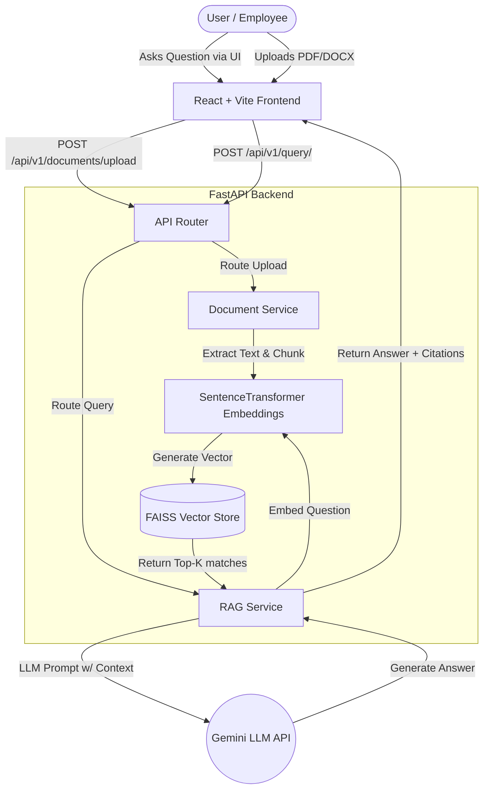
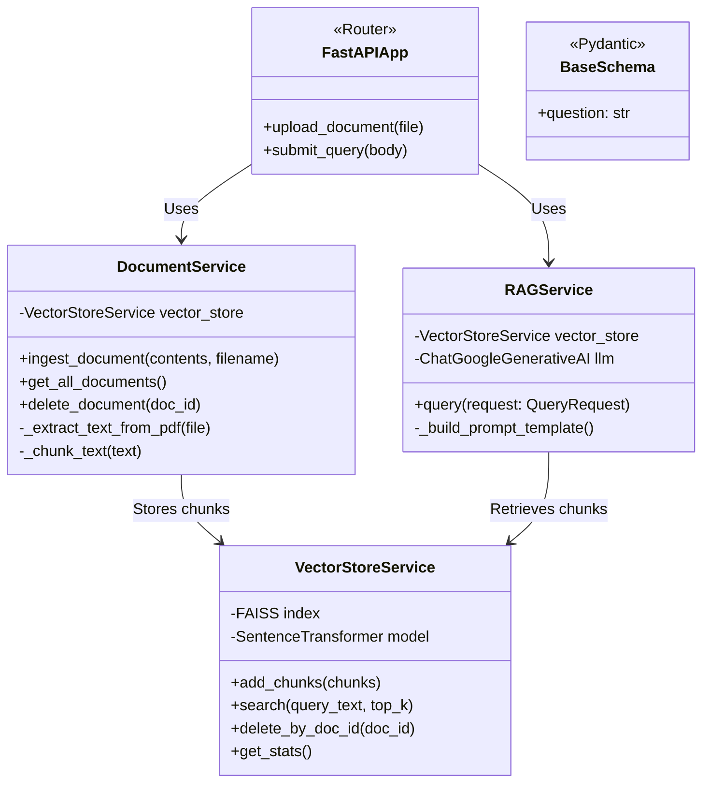

# Enterprise Knowledge Intelligence Platform Using RAG & Semantic Search

Welcome to the **Enterprise Knowledge Intelligence Platform**, a high-performance system designed to enable employees, developers, and administrators to uncover actionable intelligence from their entire corporate knowledge base using natural language.

By leveraging **Retrieval-Augmented Generation (RAG)** and **Semantic Search**, the platform securely indexes your private data and ensures that answers are always accurate, grounded, and fully cited with their original source files. 

---

## 🌟 Key Features

1. **Intelligent Document Ingestion**
   - Seamlessly upload multi-format corporate files: `.pdf`, `.docx`, and `.txt`
   - Configurable text chunking strategy using intelligent overlap to preserve sentence context.

2. **Semantic Search & Vector Store**
   - Integrates state-of-the-art **Sentence Transformers** (e.g., `all-MiniLM-L6-v2`) to perform semantic embedding.
   - High-throughput **FAISS** vector database for blazing-fast similarity searches over thousands of documents.

3. **Advanced Retrieval-Augmented Generation**
   - Configurable LLM Providers (**Google Gemini**, OpenAI, Anthropic).
   - Reduces AI hallucinations by feeding highly relevant local document chunks into the prompt context.

4. **Reference Accountability**
   - Every answer provided by the AI cites its exact source down to the internal document, boosting user trust.

5. **Production-Grade React Frontend**
   - Sony-inspired dark-mode UI built with **React + Vite + Tailwind CSS v4**.
   - Parallax 3D headphone hero with aurora glow and floating animation.
   - Glass-effect search bar with animated red border sweep.
   - Typewriter-style AI answer streaming with clickable citation badges.
   - Source chunk cards with animated similarity score bars.
   - SVG confidence ring gauge, collapsible conversation history.
   - Subtle particle background using **tsParticles**.
   - Smooth animations powered by **Framer Motion** and **GSAP**.

---

## 🏗 Architecture 

The system isolates the heavy lifting into two clear boundaries: a production-grade **React** frontend dashboard and a robust Python-based **FastAPI** backend that handles embeddings and LLM orchestration. 



---

## 📊 Class UML Diagram

A concise overview of the core Backend components. 



---

## 🚀 Setup & Installation

### Requirements
- Python 3.11+
- Node.js 18+ and npm
- API Keys for Google Gemini (or chosen LLM provider)

### Backend Setup
1. Navigate to the backend directory:
   ```bash
   cd backend
   ```
2. Create and activate a Virtual Environment:
   ```bash
   python -m venv venv
   source venv/bin/activate   # On Windows: venv\Scripts\activate
   ```
3. Install dependencies:
   ```bash
   pip install -r requirements.txt
   ```
4. Configure your `.env` variables from `.env.example`:
   ```bash
   GEMINI_API_KEY=your_key_here
   LLM_PROVIDER=gemini
   LLM_MODEL=gemini-1.5-flash
   ```
5. Run the Server:
   ```bash
   uvicorn main:app --port 8000
   ```

### Frontend Setup
1. Navigate to the frontend directory:
   ```bash
   cd frontend
   ```
2. Install dependencies:
   ```bash
   npm install
   ```
3. Configure the backend URL (optional, defaults to `http://localhost:8000`):
   ```bash
   # frontend/.env
   VITE_API_URL=http://localhost:8000
   ```
4. Start the development server:
   ```bash
   npm run dev
   ```
5. Open [http://localhost:5173](http://localhost:5173) in your browser.

> **Note:** Make sure the backend is running on port 8000 before using the frontend. The Vite dev server proxies API requests to the backend automatically.

---

## 🎨 Frontend Tech Stack

| Technology | Purpose |
|---|---|
| React + Vite | Core framework and build tool |
| Tailwind CSS v4 | Utility-first styling with custom Sony dark theme |
| Framer Motion | Component transitions and enter/exit animations |
| GSAP | Scroll and entrance animations |
| tsParticles | Subtle animated particle background |
| Axios | HTTP client with loading/error states |
| Lucide React | Icon library |

### Frontend Component Architecture

```
frontend/src/
├── api/client.js              # Axios adapter to FastAPI backend
├── hooks/useTypewriter.js     # Character-by-character streaming hook
├── components/
│   ├── Navbar.jsx             # SONY logo + AI Active badge
│   ├── HeroSection.jsx        # Parallax headphone + search + chips
│   ├── SearchBar.jsx          # Glass search bar with animated border
│   ├── ResultsPanel.jsx       # 60/40 split layout orchestrator
│   ├── AnswerPanel.jsx        # Typewriter answer + citation badges
│   ├── SourceChunks.jsx       # Knowledge chunk cards + score bars
│   ├── ConfidenceRing.jsx     # SVG arc gauge (0-100%)
│   ├── ConversationHistory.jsx # Chat-style Q&A thread
│   ├── LoadingSkeleton.jsx    # Animated skeleton placeholder
│   ├── ParticleBackground.jsx # Subtle tsParticles in dark red
│   └── Footer.jsx             # Tech stack badges
├── App.jsx                    # Main state management + layout
├── index.css                  # Tailwind v4 theme + custom keyframes
└── main.jsx                   # React entry point
```
