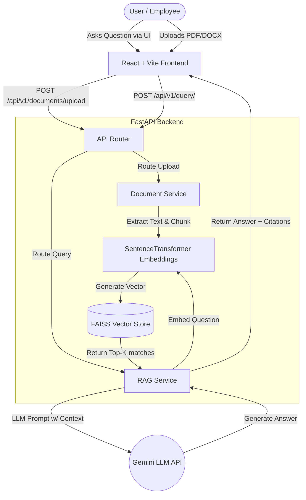
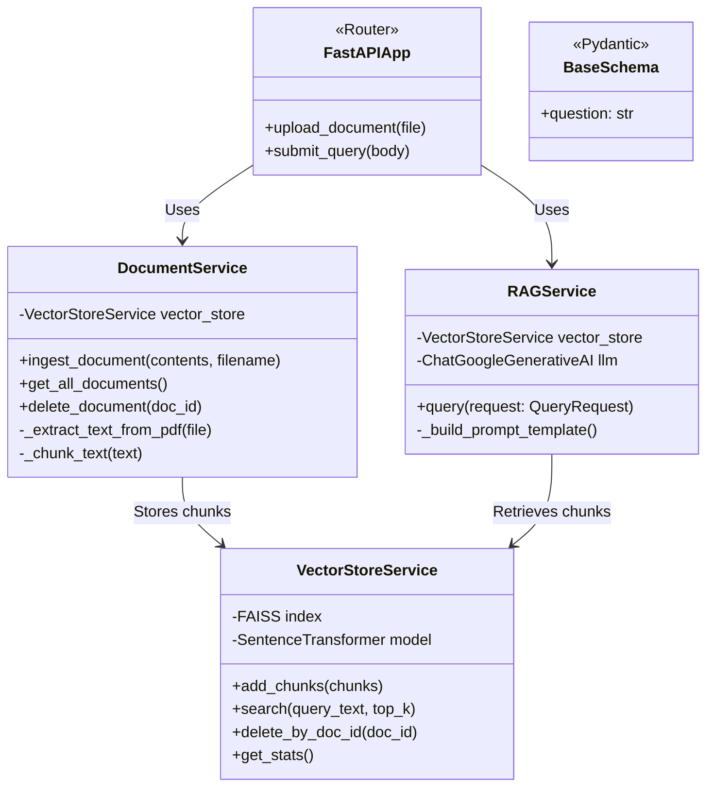

# Enterprise Knowledge Intelligence Platform Using RAG & Semantic Search

Welcome to the **Enterprise Knowledge Intelligence Platform**, a high-performance system designed to enable employees, developers, and administrators to uncover actionable intelligence from their entire corporate knowledge base using natural language.

By leveraging **Retrieval-Augmented Generation (RAG)** and **Semantic Search**, the platform securely indexes your private data and ensures that answers are always accurate, grounded, and fully cited with their original source files. 

---

## 🌟 Key Features

1. **Intelligent Document Ingestion**
   - Seamlessly upload multi-format corporate files: `.pdf`, `.docx`, and `.txt`
   - Configurable text chunking strategy using intelligent overlap to preserve sentence context.

2. **Semantic Search & Vector Store**
   - Integrates state-of-the-art **Sentence Transformers** (e.g., `all-MiniLM-L6-v2`) to perform semantic embedding.
   - High-throughput **FAISS** vector database for blazing-fast similarity searches over thousands of documents.

3. **Advanced Retrieval-Augmented Generation**
   - Configurable LLM Providers (**Google Gemini**, OpenAI, Anthropic).
   - Reduces AI hallucinations by feeding highly relevant local document chunks into the prompt context.

4. **Reference Accountability**
   - Every answer provided by the AI cites its exact source down to the internal document, boosting user trust.

5. **Production-Grade React Frontend**
   - Sony-inspired dark-mode UI built with **React + Vite + Tailwind CSS v4**.
   - Drag-and-drop document upload with progress tracking.
   - Parallax 3D headphone hero with aurora glow and floating animation.
   - Glass-effect search bar with animated red border sweep.
   - Typewriter-style AI answer streaming with clickable citation badges.
   - Source chunk cards with animated similarity score bars.
   - SVG confidence ring gauge, collapsible conversation history.
   - Subtle particle background using **tsParticles**.
   - Smooth animations powered by **Framer Motion** and **GSAP**.

---

## 🏗 Architecture 

The system isolates the heavy lifting into two clear boundaries: a production-grade **React** frontend dashboard and a robust Python-based **FastAPI** backend that handles embeddings and LLM orchestration. 


```mermaid
graph TD
    User([User / Employee]) -->|Asks Question via UI| Frontend[React + Vite Frontend]
    User -->|Uploads PDF/DOCX| Frontend

    subgraph Backend [FastAPI Backend]
        API[API Router]
        DocService[Document Service]
        RAGService[RAG Service]
        VectorStore[(FAISS Vector Store)]
        Embedder[SentenceTransformer Embeddings]
    end

    Frontend -->|POST /api/v1/documents/upload| API
    Frontend -->|POST /api/v1/query/| API

    API -->|Route Upload| DocService
    API -->|Route Query| RAGService

    DocService -->|Extract Text & Chunk| Embedder
    Embedder -->|Generate Vector| VectorStore

    RAGService -->|Embed Question| Embedder
    VectorStore -->|Return Top-K matches| RAGService
    
    RAGService -->|LLM Prompt w/ Context| Gemini((Gemini LLM API))
    Gemini -->|Generate Answer| RAGService
    RAGService -->|Return Answer + Citations| Frontend
```

---

## 📊 Class UML Diagram

A concise overview of the core Backend components. 


```mermaid
classDiagram
    class FastAPIApp {
        <<Router>>
        +upload_document(file)
        +submit_query(body)
    }

    class DocumentService {
        -VectorStoreService vector_store
        +ingest_document(contents, filename)
        +get_all_documents()
        +delete_document(doc_id)
        -_extract_text_from_pdf(file)
        -_chunk_text(text)
    }

    class RAGService {
        -VectorStoreService vector_store
        -ChatGoogleGenerativeAI llm
        +query(request: QueryRequest)
        -_build_prompt_template()
    }

    class VectorStoreService {
        -FAISS index
        -SentenceTransformer model
        +add_chunks(chunks)
        +search(query_text, top_k)
        +delete_by_doc_id(doc_id)
        +get_stats()
    }

    class BaseSchema {
        <<Pydantic>>
        +question: str
    }

    FastAPIApp --> DocumentService : Uses
    FastAPIApp --> RAGService : Uses
    DocumentService --> VectorStoreService : Stores chunks
    RAGService --> VectorStoreService : Retrieves chunks
```

---

## 📁 Project Structure

```
Enterprise-Knowledge-Intelligence-Platform-Using-RAG-Semantic-Search/
├── .github/workflows/
│   └── ci.yml                    # GitHub Actions CI pipeline
├── backend/
│   ├── app/
│   │   ├── api/
│   │   │   ├── auth.py           # JWT authentication routes
│   │   │   ├── documents.py      # Document upload/list/delete endpoints
│   │   │   └── query.py          # RAG query + health check endpoints
│   │   ├── core/
│   │   │   ├── config.py         # Pydantic settings (env-driven)
│   │   │   └── security.py       # JWT + bcrypt password utilities
│   │   ├── db/
│   │   │   └── database.py       # SQLAlchemy session factory
│   │   ├── models/
│   │   │   ├── schemas.py        # Pydantic request/response schemas
│   │   │   └── user.py           # User ORM model
│   │   └── services/
│   │       ├── document_service.py   # Parse → chunk → embed pipeline
│   │       ├── rag_service.py        # LLM query + extractive fallback
│   │       └── vector_store_service.py  # FAISS index management
│   ├── tests/
│   │   ├── conftest.py           # Shared pytest fixtures
│   │   ├── test_api.py           # FastAPI integration tests
│   │   ├── test_document_service.py  # Document ingestion tests
│   │   ├── test_schemas.py       # Pydantic validation tests
│   │   └── test_vector_store.py  # FAISS search/delete tests
│   ├── Dockerfile                # Backend container image
│   ├── main.py                   # FastAPI app entry point
│   ├── requirements.txt          # Python dependencies
│   ├── .env.example              # Environment variable template
│   └── sony_headphones_catalog.txt  # Sample data (auto-ingested)
├── frontend/
│   ├── src/
│   │   ├── api/client.js         # Axios API adapter
│   │   ├── hooks/useTypewriter.js
│   │   ├── components/
│   │   │   ├── AnswerPanel.jsx
│   │   │   ├── ConfidenceRing.jsx
│   │   │   ├── ConversationHistory.jsx
│   │   │   ├── DocumentUpload.jsx    # Drag-and-drop upload
│   │   │   ├── Footer.jsx
│   │   │   ├── HeroSection.jsx
│   │   │   ├── LoadingSkeleton.jsx
│   │   │   ├── Navbar.jsx
│   │   │   ├── ParticleBackground.jsx
│   │   │   ├── QueryPlaybook.jsx
│   │   │   ├── ResultsPanel.jsx
│   │   │   ├── SearchBar.jsx
│   │   │   ├── SourceChunks.jsx
│   │   │   └── SystemHealthPanel.jsx
│   │   ├── App.jsx
│   │   ├── index.css
│   │   └── main.jsx
│   ├── Dockerfile                # Multi-stage Node → Nginx
│   ├── .env.example              # Frontend env template
│   └── package.json
├── docker-compose.yml            # Full-stack orchestration
├── .gitignore
└── README.md
```

---

## 🚀 Setup & Installation

### Requirements
- Python 3.11+
- Node.js 18+ and npm
- API Keys for Google Gemini (or chosen LLM provider)

### Backend Setup
1. Navigate to the backend directory:
   ```bash
   cd backend
   ```
2. Create and activate a Virtual Environment:
   ```bash
   python -m venv venv
   source venv/bin/activate   # On Windows: venv\Scripts\activate
   ```
3. Install dependencies:
   ```bash
   pip install -r requirements.txt
   ```
4. Configure your `.env` variables from `.env.example`:
   ```bash
   cp .env.example .env
   # Then edit .env and add your real API key:
   GEMINI_API_KEY=your_real_key_here
   LLM_PROVIDER=gemini
   LLM_MODEL=gemini-1.5-flash
   ```
5. Run the Server:
   ```bash
   uvicorn main:app --port 8000
   ```

### Frontend Setup
1. Navigate to the frontend directory:
   ```bash
   cd frontend
   ```
2. Install dependencies:
   ```bash
   npm install
   ```
3. Configure the backend URL (optional, defaults to `http://localhost:8000`):
   ```bash
   cp .env.example .env
   # frontend/.env
   VITE_API_URL=http://localhost:8000
   ```
4. Start the development server:
   ```bash
   npm run dev
   ```
5. Open [http://localhost:5173](http://localhost:5173) in your browser.

> **Note:** Make sure the backend is running on port 8000 before using the frontend. The Vite dev server proxies API requests to the backend automatically.

---

## 🐳 Docker Deployment

Run the entire stack with a single command:

```bash
docker-compose up --build
```

| Service   | URL                     | Description               |
|-----------|-------------------------|---------------------------|
| Backend   | http://localhost:8000   | FastAPI + Swagger docs    |
| Frontend  | http://localhost:8080   | React production build    |
| API Docs  | http://localhost:8000/docs | Interactive Swagger UI |

To stop all services:
```bash
docker-compose down
```

---

## 📡 API Endpoints

### Health & Info

| Method | Endpoint             | Description                     |
|--------|----------------------|---------------------------------|
| GET    | `/`                  | App name and version            |
| GET    | `/api/v1/ping`       | Simple liveness check           |
| GET    | `/api/v1/query/health` | System health with stats      |

### Documents

| Method | Endpoint                      | Description                          |
|--------|-------------------------------|--------------------------------------|
| POST   | `/api/v1/documents/upload`    | Upload and ingest a document         |
| GET    | `/api/v1/documents/`          | List all indexed documents           |
| GET    | `/api/v1/documents/{doc_id}`  | Get metadata for a single document   |
| DELETE | `/api/v1/documents/{doc_id}`  | Remove a document from the index     |

#### Example — Upload a document

```bash
curl -X POST http://localhost:8000/api/v1/documents/upload \
  -F "file=@my_document.pdf"
```

**Response:**
```json
{
  "success": true,
  "doc_id": "a1b2c3d4-...",
  "filename": "my_document.pdf",
  "chunks_created": 15,
  "message": "Document successfully ingested and indexed."
}
```

### Query (RAG)

| Method | Endpoint           | Description                       |
|--------|--------------------|-----------------------------------|
| POST   | `/api/v1/query/`   | Ask a question over indexed docs  |

#### Example — Submit a query

```bash
curl -X POST http://localhost:8000/api/v1/query/ \
  -H "Content-Type: application/json" \
  -d '{"question": "What is the battery life of WH-1000XM5?", "top_k": 5}'
```

**Response:**
```json
{
  "query_id": "...",
  "question": "What is the battery life of WH-1000XM5?",
  "answer": "The Sony WH-1000XM5 offers up to 30 hours of battery life...",
  "sources": [
    {
      "doc_id": "...",
      "filename": "sony_headphones_catalog.txt",
      "chunk_index": 2,
      "relevance_score": 92.5,
      "excerpt": "...",
      "page_number": 1
    }
  ],
  "total_sources_found": 5,
  "model_used": "gemini/gemini-1.5-flash",
  "processing_time_ms": 1523.4
}
```

---

## 🧪 Testing

The backend includes a full test suite using **pytest**:

```bash
cd backend
pip install pytest pytest-asyncio httpx
pytest tests/ -v
```

**Test coverage includes:**
- **Schema validation** — Pydantic model constraints
- **Document service** — Parsing, chunking, ingestion, deletion
- **Vector store** — FAISS add/search/delete operations
- **API integration** — FastAPI endpoint testing with `TestClient`

Tests run automatically on every push via [GitHub Actions CI](.github/workflows/ci.yml).

---

## 🎨 Frontend Tech Stack

| Technology | Purpose |
|---|---|
| React + Vite | Core framework and build tool |
| Tailwind CSS v4 | Utility-first styling with custom Sony dark theme |
| Framer Motion | Component transitions and enter/exit animations |
| GSAP | Scroll and entrance animations |
| tsParticles | Subtle animated particle background |
| Axios | HTTP client with loading/error states |
| Lucide React | Icon library |

---

## 🤝 Contributing

1. Fork the repository
2. Create a feature branch: `git checkout -b feature/my-feature`
3. Make your changes and add tests
4. Run `pytest tests/ -v` to make sure tests pass
5. Commit with a descriptive message: `git commit -m "Add document upload progress tracking"`
6. Push to your fork and open a Pull Request

---

## 📄 License

This project is for educational and demonstration purposes.
